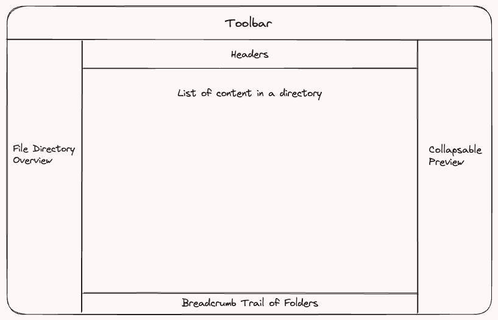

# J-File Explorer
Java-based File Explorer

# Features
## Core
- Navigate through the file directories
    - List files and folders
- Have an overall view of the file directory
    - Accordion dropdown for nests

## Quality of Life
- Preview highlighted files
- Folder breadcrumb trail

# Design

# Approach
1. Project scaffolding
    - Renaming files from bootstrapped code
    - Setup key components including linkages: Main view. Stylesheet. Main controller. Application starting point.
2. Develop core features
3. Develop QoL features

# Technology Stack
- Java 17
- Java FX
