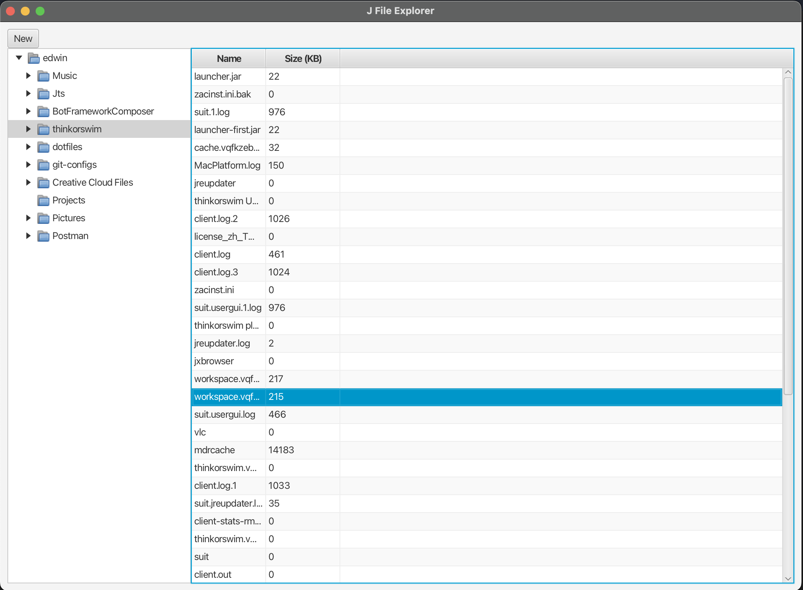

# J-File Explorer
Java-based File Explorer for project 3 - Directory Browser

# Usage
Folders can be opened up and view by double-clicking in the directory overview to expand the folder
or clicking once to show the contents within the folder.

If there are no items in the folder, the content pane will be empty.

# Features
## Core
- Navigate through the file directories
    - List files and folders
- Have an overall view of the file directory
    - Accordion dropdown for nested items

## Quality of Life
- Preview highlighted files
- Folder breadcrumb trail

# Design

# Approach
1. Project scaffolding
    - Renaming files from bootstrapped code
    - Setup key components including linkages: Main view. Stylesheet. Main controller. Application starting point.
2. Develop core features
3. Develop QoL features

# Technology Stack
- Java 17
- Java FX
- Maven

# Current Progress

# Things to note
Application will stop going through the file system as soon as it encounters the first permission error. 
Thus displaying only those that have been indexed.
